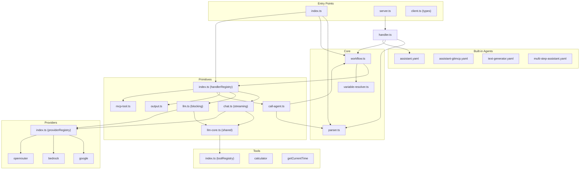

# Components

## Core Components

### Parser (`src/core/parser.ts`)

**Responsibility:** Load and parse YAML workflow definitions securely.

**Key Interfaces:**
- `loadYaml(path: string): Promise<ParsedYaml>`

**Dependencies:** `js-yaml`

**Technology Stack:** Uses `FAILSAFE_SCHEMA` to prevent function instantiation.

---

### WorkflowExecutor (`src/core/workflow.ts`)

**Responsibility:** Execute workflow steps sequentially, managing context, variable storage, and observability tracing.

**Key Interfaces:**
- `constructor(yaml: ParsedYaml)`
- `execute(input: any): Promise<Response | Record<string, unknown>>`

**Observability Support:**
- Reads `metadata.observability.enabled` from YAML
- Emits `step-start`, `step-complete`, `step-error` events
- Attaches `__trace` array to response when enabled
- Sanitizes error types for security (never exposes full error messages)

**Dependencies:** `handlerRegistry` (primitives)

**Technology Stack:** Pure TypeScript, no external dependencies.

---

### Variable Resolver (`src/core/variable-resolver.ts`)

**Responsibility:** Resolve `$input.*`, `$stepResult.*`, and `$env.*` variable references.

**Key Interfaces:**
- `resolveVariables(template: any, context: ExecutionContext): any`

**Dependencies:** None

**Technology Stack:** Pure TypeScript.

---

## Primitives

### Primitive Handler Registry (`src/primitives/index.ts`)

**Responsibility:** Register and lookup primitive handlers by step type.

**Key Interfaces:**
- `handlerRegistry: Record<string, PrimitiveHandler>`
- `registerPrimitive(type: string, handler: PrimitiveHandler): void`

**Built-in Primitives:**
- `chat` — Frontend streaming interface
- `llm` — Workflow LLM calls (non-streaming)
- `output-generator` — JSON transform
- `call-agent` — Sub-agent invocation
- `mcp-tool` — External MCP server integration

---

### LLM Core (`src/primitives/llm-core.ts`)

**Responsibility:** Shared utilities for `chat` and `llm` primitives.

**Key Interfaces:**
- `mapTools(toolDefinitions): ToolSet` — Maps YAML tool definitions to SDK tools
- `registerCallback(name: string, fn: CallbackFn): void` — Register lifecycle callbacks
- `callbackRegistry: Record<string, CallbackFn>` — Stores registered callbacks
- `LlmConfig` — Type definition for LLM step configuration

**Dependencies:** `ai`, `toolRegistry`

---

### Chat Primitive (`src/primitives/chat.ts`)

**Responsibility:** Frontend chat interface with streaming responses.

**Behavior:**
- **Always streams** — Returns `Response` via `toUIMessageStreamResponse()`
- Converts `UIMessage[]` (from `useChat`) to `ModelMessage[]`
- **Resolves variables in system prompt** (e.g., `$stepResult.mcpDocs.data`)
- Supports `onFinish` and `onError` lifecycle callbacks
- **Observability:** When trace is present, sends events as transient data before stream

**Key Interfaces:**
- `chatPrimitive(config: StepConfig, context: ExecutionContext): Promise<Response>`

**Dependencies:** `ai` (streamText, convertToModelMessages), `providerRegistry`, `toolRegistry`, `callbackRegistry`

**Use for:** API routes serving `useChat` frontend hooks.

---

### LLM Primitive (`src/primitives/llm.ts`)

**Responsibility:** Workflow LLM calls with complete results for chaining.

**Behavior:**
- **Never streams** — Returns `{ text, usage }` object
- Uses `ModelMessage[]` format directly (no conversion)
- **Resolves variables in system prompt** (e.g., `$stepResult.*.text`)
- Result stored in `context.variables` for subsequent steps

**Key Interfaces:**
- `llmPrimitive(config: StepConfig, context: ExecutionContext): Promise<Record<string, unknown>>`

**Dependencies:** `ai` (generateText), `providerRegistry`, `toolRegistry`

**Use for:** Internal workflows, `call-agent`, multi-step pipelines.

---

### Call Agent Primitive (`src/primitives/call-agent.ts`)

**Responsibility:** Invoke another YAML workflow as a subroutine.

**Behavior:**
- Loads and executes another agent's workflow
- Passes resolved input to the sub-agent
- Returns sub-agent's result for workflow chaining

**Key Interfaces:**
- `callAgentPrimitive(config: StepConfig, context: ExecutionContext): Promise<Response | Record<string, unknown>>`

**Dependencies:** `loadYaml`, `WorkflowExecutor`, `resolveVariables`

---

### MCP Tool Primitive (`src/primitives/mcp-tool.ts`)

**Responsibility:** Connect to external MCP servers via SSE and execute tools.

**Behavior:**
- Lazy loads `@modelcontextprotocol/sdk` to avoid issues if not installed
- Connects via SSE transport to MCP servers
- Supports tool discovery via `list_tools` special tool name
- 30s timeout protection (configurable)
- Returns `{ success, data, toolNames?, error? }`

**Key Interfaces:**
- `mcpToolPrimitive(config: StepConfig, context: ExecutionContext): Promise<Record<string, unknown>>`

**Config Options:**

| Property | Type | Required | Description |
|----------|------|----------|-------------|
| `url` | `string` | Yes | MCP server URL (SSE endpoint) |
| `tool` | `string` | Yes | Tool name to execute (or `list_tools` for discovery) |
| `arguments` | `object` | No | Arguments to pass to the tool |
| `timeout` | `number` | No | Timeout in ms (default: 30000) |

**Dependencies:** `@modelcontextprotocol/sdk` (optional, lazy-loaded)

**Use for:** GitMCP, Context7, custom MCP servers.

---

### Design Decision: Semantic Primitive Separation

**Why `chat` converts messages and `llm` doesn't:**

The AI SDK v6 has two message formats:
- `UIMessage[]` — Frontend format from `useChat` hook (with `parts` array)
- `ModelMessage[]` — Backend format for `streamText`/`generateText` (with `content`)

| Primitive | Input Format | Conversion | Reason |
|-----------|--------------|------------|--------|
| `chat` | `UIMessage[]` | `convertToModelMessages()` | Data comes from `useChat` frontend |
| `llm` | `ModelMessage[]` | None | Data comes from workflow steps or YAML |

**Why no `stream` property in YAML:**

The streaming behavior is **semantically determined by the primitive type**, not a configuration flag:
- `type: "chat"` → Always streams (for responsive frontend UX)
- `type: "llm"` → Never streams (result needed for workflow chaining)

This design is cleaner than a `stream: true/false` flag because:
1. Prevents misconfiguration (e.g., streaming in a multi-step workflow)
2. Makes intent explicit in the YAML
3. Aligns with AI SDK v6 patterns (`streamText` vs `generateText`)

---

### Output Primitive (`src/primitives/output.ts`)

**Responsibility:** Deterministic JSON transform using variable resolution.

**Key Interfaces:**
- `outputPrimitive(config: StepConfig, context: ExecutionContext): Promise<Record<string, unknown>>`

**Dependencies:** `resolveVariables`

---

## Providers

### Provider Registry (`src/providers/index.ts`)

**Responsibility:** Register and provide LLM provider implementations.

**Key Interfaces:**
- `providerRegistry: Record<string, ProviderImplementation>`
- `registerProvider(name: string, implementation: ProviderImplementation): void`
- `createModel(provider: string, config: ProviderConfig): LanguageModel`

**Built-in Providers:**

| Provider | Package | Environment Variables |
|----------|---------|----------------------|
| `google` | `@ai-sdk/google` | `GEMINI_API_KEY` |
| `bedrock` | `@ai-sdk/amazon-bedrock` | `AWS_REGION`, AWS credentials |
| `openrouter` | `@ai-sdk/openai` | `OPENROUTER_API_KEY` |

---

## Tools

### Tool Registry (`src/tools/index.ts`)

**Responsibility:** Register and provide tool implementations for LLM primitives.

**Key Interfaces:**
- `toolRegistry: Record<string, ToolImplementation>`
- `registerTool(name: string, implementation: ToolImplementation): void`

**Built-in Tools:**
- `calculator` — Evaluate mathematical expressions
- `getCurrentTime` — Get current ISO timestamp

---

## Server

### Server Handler (`src/server/handler.ts`)

**Responsibility:** Factory for creating Next.js API route handlers.

**Key Interfaces:**
- `createBeddelHandler(options?: BeddelHandlerOptions): BeddelHandler`

**Options:**
- `agentsPath` — Directory for user agents (default: `'src/agents'`)
- `disableBuiltinAgents` — Disable built-in agents (default: `false`)

---

## Built-in Agents (`src/agents/`)

Pre-configured agents bundled with the package, organized by category:

| Agent | Category | Type | Description |
|-------|----------|------|-------------|
| `assistant` | `chat/` | `chat` | Google Gemini streaming assistant |
| `assistant-bedrock` | `chat/` | `chat` | Amazon Bedrock assistant |
| `assistant-openrouter` | `chat/` | `chat` | OpenRouter free tier assistant |
| `assistant-gitmcp` | `mcp/` | `mcp-tool` + `chat` | Documentation assistant via GitMCP |
| `business-analyzer` | `google-business/` | `google-business` + `llm` | Business reviews analyzer |
| `newsletter-signup` | `marketing/` | `llm` + `notion` | Lead capture with Notion |
| `text-generator` | `utility/` | `llm` | Text generation (non-streaming) |
| `observability-demo` | `observability/` | `mcp-tool` + `llm` | Multi-step demo with trace collection |
| `multi-step-assistant` | `examples/` | `call-agent` + `llm` | 4-step analysis pipeline |

**Categories:** `chat/`, `mcp/`, `google-business/`, `marketing/`, `utility/`, `observability/`, `examples/`

---

## Component Diagram

