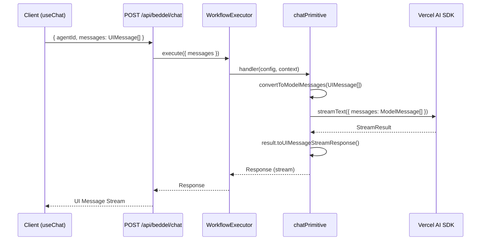
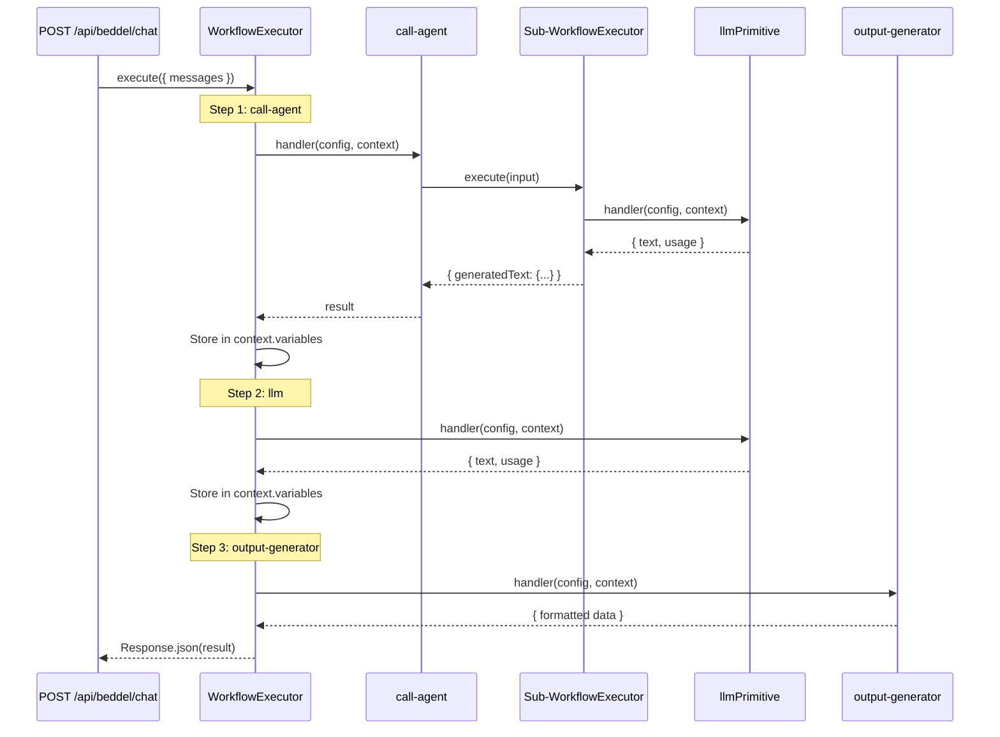
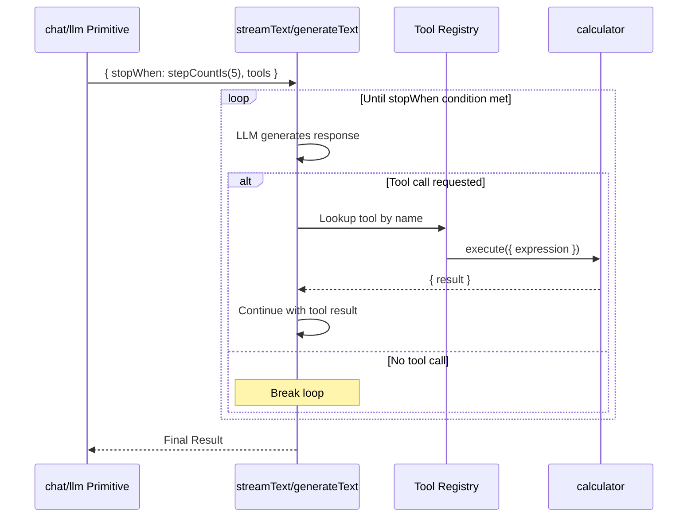
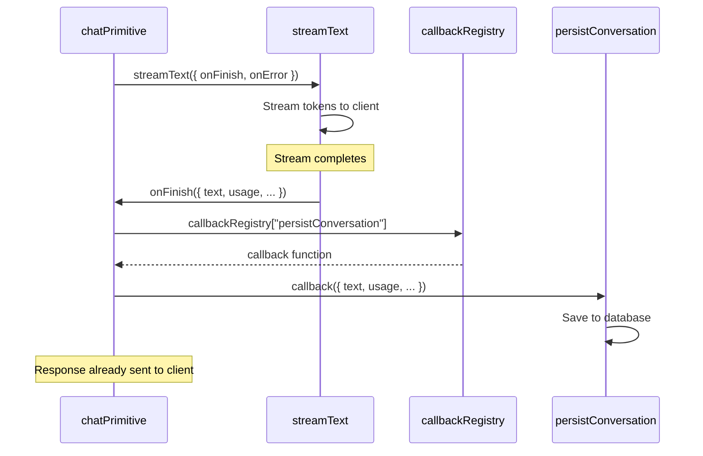

# Core Workflows

## Consumer Setup Flow

### 1. Install Package

```bash
npm install beddel
# or
pnpm add beddel
```

### 2. Create API Route

```typescript
// app/api/beddel/chat/route.ts
import { createBeddelHandler } from 'beddel/server';

export const POST = createBeddelHandler({
  agentsPath: 'src/agents',      // Optional, default: 'src/agents'
  disableBuiltinAgents: false,   // Optional, default: false
});
```

### 3. Create YAML Agents

#### Frontend Chat Agent (uses `chat` primitive)

```yaml
# src/agents/assistant.yaml
metadata:
  name: "Streaming Assistant"
  version: "1.0.0"

workflow:
  - id: "chat-interaction"
    type: "chat"
    config:
      provider: "google"
      model: "gemini-2.0-flash-exp"
      system: "You are a helpful assistant."
      messages: "$input.messages"
```

#### Workflow Agent (uses `llm` primitive)

```yaml
# src/agents/text-generator.yaml
metadata:
  name: "Text Generator"
  version: "1.0.0"

workflow:
  - id: "generate-text"
    type: "llm"
    config:
      provider: "google"
      model: "gemini-2.0-flash-exp"
      system: "Generate creative text based on the prompt."
      messages: "$input.messages"
    result: "generatedText"
```

#### Multi-Step Pipeline (uses `call-agent` + `llm`)

```yaml
# src/agents/analyzer.yaml
metadata:
  name: "Text Analyzer"
  version: "1.0.0"

workflow:
  # Step 1: Generate text using another agent
  - id: "generate"
    type: "call-agent"
    config:
      agentId: "text-generator"
      input:
        messages: "$input.messages"
    result: "generatedText"

  # Step 2: Analyze the generated text
  - id: "analyze"
    type: "llm"
    config:
      provider: "google"
      model: "gemini-2.0-flash-exp"
      system: "Extract key topics from the text."
      messages:
        - role: "user"
          content: "$stepResult.generatedText.generatedText.text"
    result: "analysis"

  # Step 3: Format output
  - id: "format"
    type: "output-generator"
    config:
      template:
        originalText: "$stepResult.generatedText.generatedText.text"
        topics: "$stepResult.analysis.text"
    result: "finalReport"
```

### 4. Use with React (useChat)

```tsx
'use client';
import { useChat } from '@ai-sdk/react';

export default function Chat() {
  const { messages, input, handleInputChange, handleSubmit } = useChat({
    api: '/api/beddel/chat',
    body: { agentId: 'assistant' },
  });

  return (
    <div>
      {messages.map((m) => (
        <div key={m.id}>{m.role}: {m.content}</div>
      ))}
      <form onSubmit={handleSubmit}>
        <input value={input} onChange={handleInputChange} />
        <button type="submit">Send</button>
      </form>
    </div>
  );
}
```

---

## Primitive Selection Guide

| Use Case | Primitive | Streaming | Message Format |
|----------|-----------|-----------|----------------|
| Frontend chat UI | `chat` | ✅ Always | UIMessage (with `parts`) |
| Workflow step | `llm` | ❌ Never | ModelMessage (with `content`) |
| Compose agents | `call-agent` | Depends | Passes through |
| Transform data | `output-generator` | ❌ Never | N/A |

---

## YAML Structure

```yaml
metadata:
  name: "Agent Name"
  version: "1.0.0"

workflow:
  - id: "step-1"
    type: "chat"          # or "llm", "call-agent", "output-generator"
    config:
      provider: "google"  # Optional: 'google', 'bedrock', 'openrouter', or custom
      model: "gemini-2.0-flash-exp"
      system: "System prompt"
      messages: "$input.messages"
      tools:              # Optional: tools for function calling
        - name: "calculator"
      onFinish: "callbackName"   # Optional: lifecycle hook (chat only)
    result: "stepOutput"  # Optional: variable name for result
```

### Variable Resolution Patterns

| Pattern | Description | Example |
|---------|-------------|---------|
| `$input.*` | Access request input data | `$input.messages` |
| `$stepResult.varName.*` | Access step result by name | `$stepResult.llmOutput.text` |
| `$env.*` | Access environment variables | `$env.NOTION_DATABASE_ID` |

---

## Chat Flow (Frontend)



## Workflow Flow (Multi-Step)



---

## Tool Loop Flow

When tools are defined, the LLM may invoke them in a multi-step loop:



---

## Lifecycle Hooks (chat primitive only)


